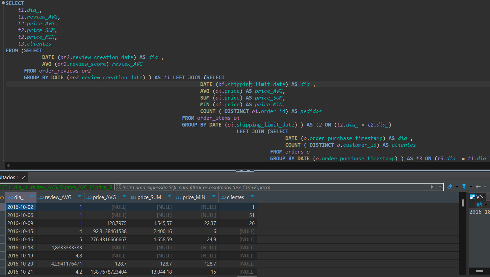

# Projeto de Análise SQL no DBeaver
## Apresentação
Este projeto consiste em uma série de consultas SQL realizadas no software DBeaver com o objetivo de explorar e analisar dados de um banco relacional de e-commerce. O banco contém informações sobre clientes, pedidos, produtos, vendedores, categorias e entregas.

As consultas foram elaboradas com foco em insights comerciais, gestão de estoque e eficiência logística.

## Objetivo Geral
- Aplicar conhecimentos de SQL para:
- Obter indicadores de vendas.
- Avaliar desempenho de clientes, produtos e vendedores.
- Apoiar a tomada de decisões estratégicas com base nos dados.

## Ferramenta Utilizada
As consultas foram desenvolvidas utilizando o software DBeaver, uma IDE de banco de dados que permite a execução e visualização de resultados SQL de forma prática e eficiente.

## Detalhamento das Consultas
### Consulta 1 – Faturamento e Quantidade de Pedidos por Cliente

#### Descrição:
A consulta realiza uma análise agregada dos pedidos, agrupando os dados por vendedor. Ela é baseada na tabela order_items e calcula estatísticas relevantes para cada seller_id.

#### Agrupamento
- GROUP BY oi.seller_id: agrupa os dados por vendedor, permitindo calcular métricas individuais para cada um.

#### Métricas calculadas para cada vendedor
- COUNT(DISTINCT oi.product_id): conta a quantidade de produtos distintos vendidos por cada vendedor.
- MAX(oi.shipping_limit_date): retorna a maior data-limite de envio registrada nos pedidos de cada vendedor.
- MIN(oi.shipping_limit_date): retorna a menor data-limite de envio registrada nos pedidos de cada vendedor.
- MAX(oi.freight_value): identifica o maior valor de frete cobrado em pedidos do vendedor.
- MIN(oi.freight_value): identifica o menor valor de frete cobrado.
- AVG(oi.freight_value): calcula a média dos valores de frete dos pedidos de cada vendedor

### Consulta 2 – Produtos Mais Vendidos em Quantidade

#### Descrição:
A consulta realiza uma análise agregada dos preços dos produtos, agrupando os dados pela identificação de cada produto. A partir da tabela order_items, ela calcula estatísticas de preço para cada product_id.

#### Agrupamento
- GROUP BY oi.product_id: agrupa os dados por produto, permitindo calcular métricas individuais de preço para cada um.

#### Métricas calculadas para cada produto
- AVG(oi.price): calcula o preço médio do produto com base nas vendas registradas.
- MIN(oi.price): retorna o menor preço pelo qual o produto foi vendido.
- MAX(oi.price): retorna o maior preço pelo qual o produto foi vendido.

### Consulta 3 – Vendas por Categoria de Produto

#### Descrição:
A consulta realiza uma análise dos itens de pedido com base em condições específicas: apenas os pedidos cujo valor do frete seja superior a 20 e que tenham uma data-limite de envio dentro do mês de outubro de 2016. Os dados são obtidos da tabela order_items.

#### Filtro aplicado
- freight_value > 20: considera apenas os pedidos com valor de frete superior a 20.
- DATE(oi.shipping_limit_date) >= '2016-10-01' AND DATE(oi.shipping_limit_date) <= '2016-10-31': limita a análise aos pedidos cuja data-limite de envio esteja - - entre 1º e 31 de outubro de 2016.

#### Métricas calculadas
- COUNT(DISTINCT oi.order_id): conta o número de pedidos únicos que atendem aos critérios definidos.
- COUNT(oi.product_id): conta o total de produtos vendidos nesses pedidos (incluindo repetições).
- AVG(oi.price): calcula o preço médio dos produtos vendidos nesses pedidos filtrados.

### Consulta 4 – Faturamento por Mês

#### Descrição:
A consulta realiza uma contagem de pedidos por status, considerando apenas os que estão com status de "processing" ou "canceled" e que possuam uma data estimada de entrega fora do intervalo entre 23 de novembro de 2016 e 1º de janeiro de 2017. Os dados utilizados pertencem à tabela orders.

#### Filtros aplicados
- o.order_status = 'processing' OR o.order_status = 'canceled': seleciona apenas pedidos que estão sendo processados ou que foram cancelados.
- o.order_estimated_delivery_date > '2017-01-01' OR o.order_estimated_delivery_date < '2016-11-23': considera apenas pedidos com data estimada de entrega fora do intervalo entre 23/11/2016 e 01/01/2017.

#### Agrupamento
- GROUP BY o.order_status: agrupa os resultados pelo status do pedido, permitindo calcular a contagem separada para cada tipo de status.

#### Métrica calculada
- COUNT(o.order_id): contabiliza o número de pedidos para cada status filtrado e agrupado.

### Consulta 5 – Faturamento por Vendedor

#### Descrição:
- A consulta analisa a tabela products, contando quantos produtos distintos existem em determinadas categorias, desde que atendam a critérios mínimos de quantidade de fotos e dimensões físicas (peso, altura e largura).

#### Filtros aplicados
- p.product_category_name IN (...): restringe os resultados apenas às seguintes categorias:
- perfumaria
- brinquedos
- esporte_lazer
- cama_mesa_banho
- moveis_escritorio
- Condições adicionais para que um produto seja considerado:
- p.product_photos_qty > 5: o produto deve ter mais de 5 fotos.
- p.product_weight_g > 5: o peso do produto deve ser superior a 5 gramas.
- p.product_height_cm > 10: a altura deve ser superior a 10 cm.
- p.product_width_cm > 20: a largura deve ser maior que 20 cm.

#### Agrupamento
- GROUP BY p.product_category_name: agrupa os dados por nome da categoria de produto.

#### Métrica calculada
- COUNT(DISTINCT p.product_id): conta quantos produtos distintos existem em cada uma das categorias selecionadas, respeitando os filtros aplicados.

###  Consulta 6 – Tempo Médio de Entrega

#### Descrição:
- A consulta realiza uma classificação de produtos com base no valor do preço, atribuindo uma categoria textual a cada item da tabela order_items conforme faixas de preço predefinidas.

#### Campos selecionados
- oi.product_id: identifica o código de cada produto.
- oi.price: mostra o valor individual do produto.
- CASE ... END AS categoria: cria uma nova coluna chamada categoria, classificando os preços em faixas específicas.

#### Lógica condicional com CASE
- WHEN oi.price < 50 THEN 'Categoria A': produtos com preço inferior a 50 são classificados como Categoria A.
- WHEN oi.price > 50 AND oi.price < 100 THEN 'Categoria B': produtos com preço entre 51 e 99 são Categoria B.
- WHEN oi.price > 100 AND oi.price < 500 THEN 'Categoria C': produtos com preço entre 101 e 499 são Categoria C.
- WHEN oi.price > 500 AND oi.price < 1500 THEN 'Categoria D': produtos com preço entre 501 e 1499 são Categoria D.
- ELSE 'CATEGORIA E': todos os demais produtos (com preço a partir de 1500 ou valores não encaixados nas faixas anteriores) são classificados como Categoria E.

#### Observação
A consulta não utiliza agregações nem agrupamentos; ela retorna uma linha para cada produto da tabela order_items, adicionando uma classificação baseada no valor do preço.

### Consulta 7 – Clientes Inativos há Mais de 6 Meses

#### Descrição:
A consulta realiza uma junção de múltiplas tabelas com o objetivo de reunir informações completas sobre os pedidos, incluindo dados do cliente, avaliação, produto, vendedor e localização. A consulta retorna apenas os 10 primeiros registros resultantes dessa junção.

#### Tabelas e junções utilizadas
- orders o: tabela principal da consulta, contendo os pedidos realizados.
- LEFT JOIN order_reviews or2 ON (o.order_id = or2.order_id): junta as avaliações dos pedidos, mesmo que nem todos os pedidos tenham avaliação.
- LEFT JOIN order_payments op ON (o.order_id = op.order_id): junta os dados de pagamento aos pedidos.
- LEFT JOIN customer c ON (c.customer_id = o.customer_id): junta os dados dos clientes que realizaram os pedidos.
- LEFT JOIN order_items oi ON (o.order_id = oi.order_id): junta os itens que compõem cada pedido.
- LEFT JOIN products p ON (p.product_id = oi.product_id): junta os produtos associados a cada item de pedido.
- LEFT JOIN sellers s ON (s.seller_id = oi.seller_id): junta os dados dos vendedores responsáveis pelos produtos.
- LEFT JOIN geolocation g ON (g.geolocation_zip_code_prefix = s.seller_zip_code_prefix): junta as informações de localização geográfica com base no CEP do vendedor.

#### Campos selecionados
- o.order_id: identificador do pedido.
- c.customer_id: identificador do cliente que fez o pedido.
- or2.review_id: identificador da avaliação feita ao pedido.
- oi.order_item_id: número do item dentro do pedido.
- p.product_id: identificador do produto.
- s.seller_id: identificador do vendedor responsável pelo item.
- g.geolocation_lat: latitude associada ao CEP do vendedor.
- g.geolocation_lng: longitude associada ao CEP do vendedor.

#### Limitação de resultados
- LIMIT 10: a consulta retorna apenas os 10 primeiros resultados da junção, útil para visualização amostral

### Consulta 8 – Produtos com Estoque Baixo

#### Descrição:
A consulta analisa três conjuntos de dados relacionados a pedidos, avaliações e clientes, agregando informações diárias para cruzar métricas de reviews, preços dos itens e número de clientes.

#### Agrupamento
Cada subconsulta agrupa os dados pela data (dia) extraída dos respectivos campos de data de cada tabela.

#### Métricas calculadas
##### Tabela de avaliações (t1):
- dia_: data do review.
- review_AVG: média das notas (review_score) das avaliações feitas naquele dia.

##### Tabela de itens do pedido (t2):
- dia_: data limite de envio do item.
- price_AVG: média dos preços dos itens nesse dia.
- price_SUM: soma dos preços dos itens nesse dia.
- price_MIN: menor preço de item nesse dia.
- pedidos: quantidade distinta de pedidos feitos nesse dia.

#### Tabela de pedidos (t3):
- dia_: data da compra do pedido.
- clientes: quantidade distinta de clientes que efetuaram pedidos nesse dia.

#### Junções
A junção principal é feita usando a data (dia_) das avaliações (t1) com as datas de envio dos itens (t2) e de compra dos pedidos (t3), unindo as métricas diárias em uma visão única.
