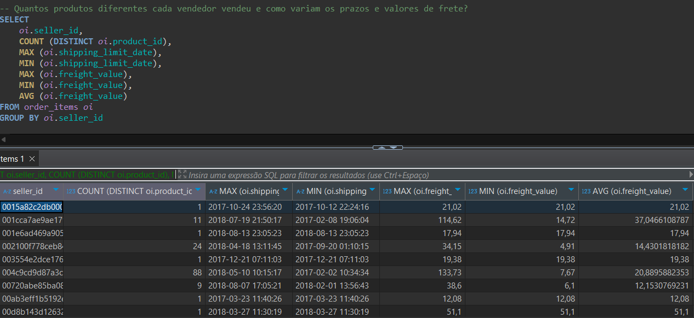
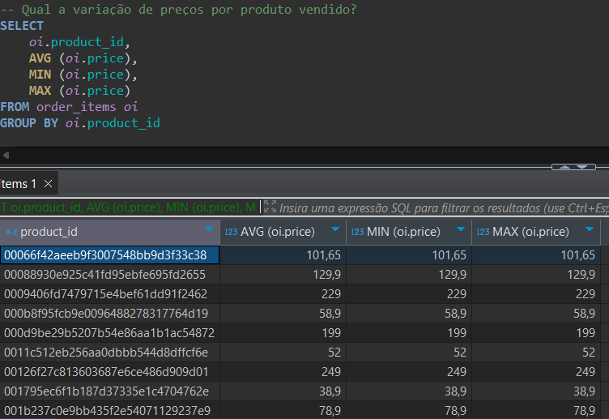
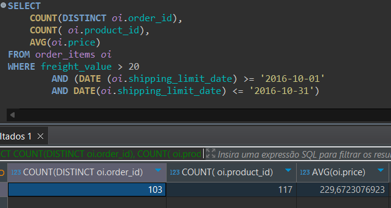
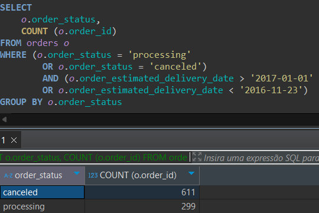
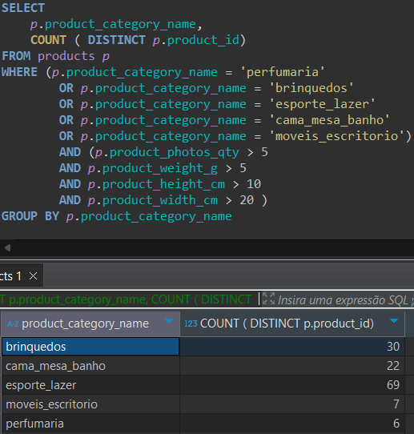
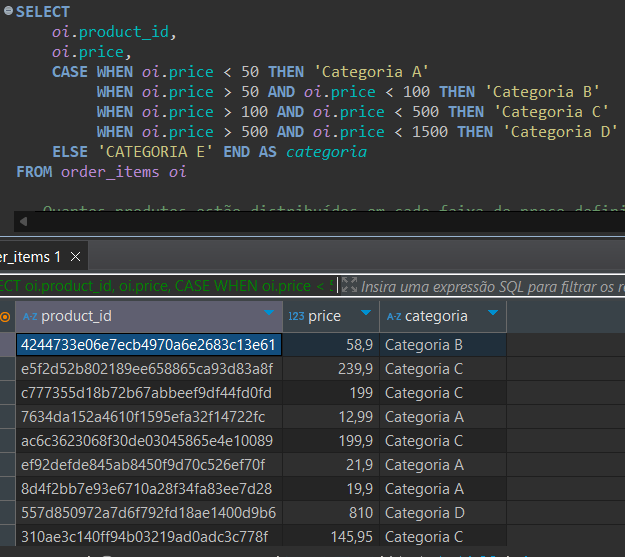
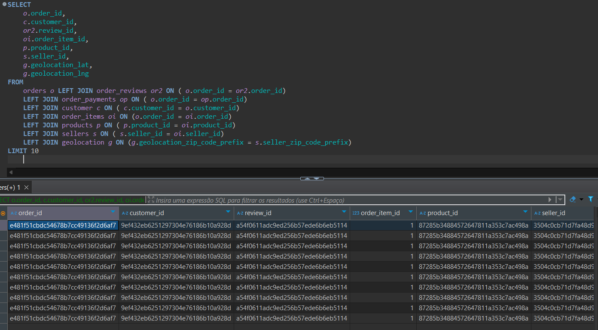

# Projeto de Análise SQL no DBeaver
## Apresentação
Este projeto consiste em uma série de consultas SQL realizadas no software DBeaver com o objetivo de explorar e analisar dados de um banco relacional de e-commerce. O banco contém informações sobre clientes, pedidos, produtos, vendedores, categorias e entregas.

As consultas foram elaboradas com foco em insights comerciais, gestão de estoque e eficiência logística.

## Objetivo Geral
- Aplicar conhecimentos de SQL para:
- Obter indicadores de vendas.
- Avaliar desempenho de clientes, produtos e vendedores.
- Apoiar a tomada de decisões estratégicas com base nos dados.

## Ferramenta Utilizada
As consultas foram desenvolvidas utilizando o software DBeaver, uma IDE de banco de dados que permite a execução e visualização de resultados SQL de forma prática e eficiente.

## Detalhamento das Consultas
### Consulta 1 – Faturamento e Quantidade de Pedidos por Cliente

Descrição:
- Calcula o número total de pedidos e o valor total comprado por cada cliente.
- Usa JOIN para integrar as tabelas de clientes, pedidos e itens do pedido.
- Agrupamento por cliente para consolidar os dados.
- Objetivo: Identificar os clientes mais valiosos para o negócio.

### Consulta 2 – Produtos Mais Vendidos em Quantidade

Descrição:
- Soma a quantidade total vendida de cada produto.
- Ordena os produtos do mais vendido para o menos.
- Objetivo: Saber quais produtos têm maior saída.

### Consulta 3 – Vendas por Categoria de Produto

Descrição:
- Analisa o total de vendas (quantidade) agrupadas por categoria de produto.
- Utiliza dois JOINs para acessar categorias via produtos.
- Objetivo: Avaliar o desempenho de cada categoria.

### Consulta 4 – Faturamento por Mês

Descrição:
- Agrega o faturamento mensal com base na data de criação dos pedidos.
- Usa DATE_TRUNC para agrupar por mês.
- Objetivo: Analisar o comportamento das vendas ao longo do tempo.

### Consulta 5 – Faturamento por Vendedor

Descrição:
- Relaciona pedidos a vendedores e calcula o faturamento total por vendedor.
- Mostra quais vendedores geram mais receita.
- Objetivo: Avaliar a performance individual dos vendedores.

###  Consulta 6 – Tempo Médio de Entrega

Descrição:
- Calcula o tempo médio entre a criação e a entrega de pedidos.
- Exclui pedidos ainda não entregues.
- Objetivo: Medir a eficiência logística da operação.

### Consulta 7 – Clientes Inativos há Mais de 6 Meses

Descrição:
- Identifica clientes cuja última compra foi há mais de 6 meses.
- Usa HAVING com MAX() para filtrar inativos.
- Objetivo: Apoiar campanhas de reativação de clientes.

### Consulta 8 – Produtos com Estoque Baixo

Descrição:
- Filtra produtos cujo estoque está abaixo de um limite crítico.
- Permite monitoramento preventivo de reposição.
- Objetivo: Auxiliar a gestão de estoque para evitar ruptura.
